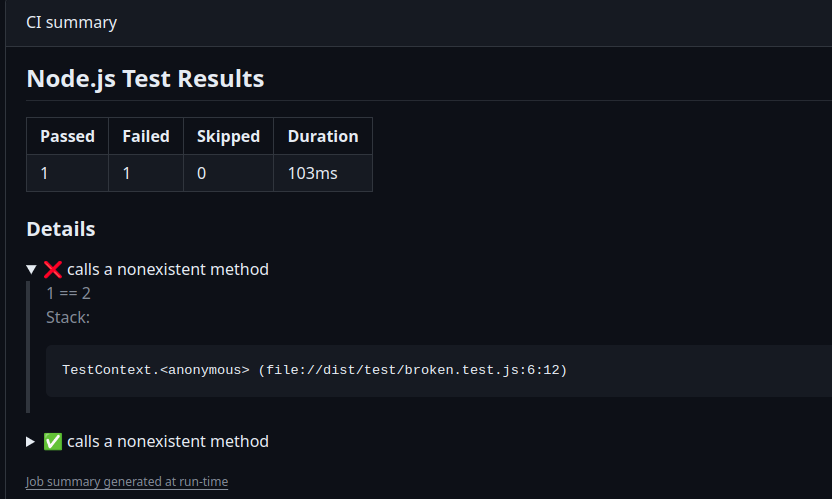

# Repo to showcase some actions

The workflows used in this repo are present here:
https://github.com/gentrop-cloud/actions_workflows

The idea of this repo is to show how to use, and discuss how to improve our workflows. 

## Linting

In some cases, our projects are not being linted, or the linting tool stop working in the middle of the project. 
To help up with that, we can run our Lint in the actions instead of having hooks. 

This action help us in two great ways:
### Annotating the linting issue on the PR. 

### Fixing auto. some linting issues

## Testing

The idea of this workflow is to show some ways of running our tests. And to have a default, but extensible, workflow to minimize some mistake that could happen.
Some nice features to showcase here is the hability to generate reports inside the action, and to generate badges after the tests.
### Reports(Success)

### Report(Failure)

### Badges